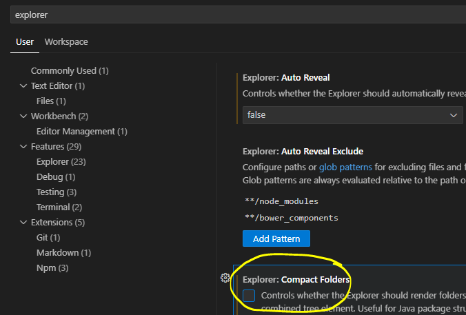
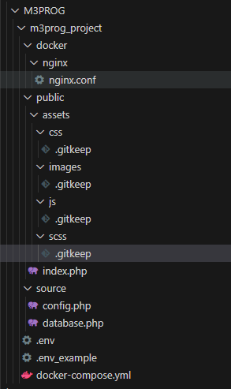

## Project folder

> Voor dat wij gaan beginnen met code schrijven is het belangrijk om de correcte structuur neer te zetten.  

## visual studio settings

Om deze oefening makkelijker te maken:
- ga in visual studio code naar:
   - file
      - preferences
         - settings
   - zoek nu op explorer
      - vink de volgende setting `UIT`
      > 

## container maken

- ga naar je `M3Prog` directory 
    > - deze had je in `01_gitsetup.md` gemaakt en naar je computer gehaald

- Maak een directory `m3prog_project` aan in de `M3PROG` directory
> Dit is vanaf nu de root folder van het project.

## mappen en bestanden maken

Om met docker en php te kunnen werken moeten we ons project inrichten met mappen en bestanden

De structuur van de folder komt er straks zo uit te zien:
> 

voer alle stappen uit die hieronder staan

## Structuur

Van te voren weten wij dat het een `php-html` project gaat worden, dus de structuur is redelijk bekend.

- alles wat je nu gaat doen moet je in de `m3prog_project` map doen 
1. ga naar `m3prog_project` en maak de volgende folders:
   > - `\docker\nginx` *( hier komt de configuratie van nginx terecht )*
   > - `\public` *( dit is de folder die zichtbaar is vanuit de browser )*
   > - `\source` *( hier staan straks de bestanden met php functies )*
2. Binnen de public folder gaan wij de assets en images plaatsen:
   > - `\public\assets\css` *( de css bestanden )*
   > - `\public\assets\js` *( de javasript bestanden )*
   > - `\public\assets\scss` *( de originele dynamische css bestanden )*
   > - `\public\images` *( afbeeldingen voor de website zoals een logo of een foto )*

## Voorbeeld bestanden
> Er zijn een aantal voorbeeld bestanden nodig waarmee wij straks aan de slag > gaan.
> Voor nu mogen dit lege bestanden zijn. 
- Maak de volgende bestanden aan:
   > - `\public\index.php`  *( dit is straks het hoofd bestand dat door de > browser gelezen gaat worden )*
   > - `\docker\nginx\nginx.conf` *( deze gaan we straks vullen )*
   > - `\source\config.php` *( hier komen de instellingen zoals de hostname en > de database login gegevens )*
   > - `\source\database.php` *( dit bestand gebruiken wij straks voor de > database verbinding )*
   > - `\.env` *( Hier komen je instellingen zoals de database login gegevens > te staan )*
   > - `\.env_example` *( Dit is een voorbeeld van hoe de structuur van de .> `env` file eruit moet zien )*
   > - `\docker-compose.yml` *( hiermee kunnen wij de ontwikkelomgeving opzetten )*

## Git keep
> Git keep is een leeg bestandje dat ervoor zorgt dat je een lege folder kunt > toevoegen aan git.
> Hierdoor kun je een structuur aanmaken voordat de echte bestanden straks > beschikbaar zijn.
- Maak een bestand aan met de naam `.gitkeep`
- Plaats dit bestand in de volgende folders:
    > - `public/assets/css`
    > - `public/assets/js`
    > - `public/assets/scss`
    > - `public/images`

## opdrachten folders

- Maak de volgende directories aan onder `public`:
   - 01
   - 02
   - 03
   - 04
   - 05
   - 06
   - 07
   - 08
- zet in al die directories ook het `.gitkeep` bestand
 
## Resultaat
De structuur van de folder zou er zo uit moeten zien:  

