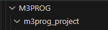

## Project folder

> Voor dat wij gaan beginnen met code schrijven is het belangrijk om de correcte structuur neer te zetten.  

## visual studio settings

Om deze oefening makkelijker te maken:
- ga in visual studio code naar:
   - file
      - preferences
         - settings
   - zoek nu op explorer
      - vink de volgende setting `UIT`
      > 

## container maken

- ga naar je `M3Prog` directory 
    > deze had je in `01_gitsetup.md` gemaakt en naar je computer gehaald

- Maak een directory `m3prog_project` aan in de `M3PROG` directory
   >   
   > Dit is vanaf nu de root folder van het project.

## mappen en bestanden maken

- lees:
> Van te voren weten wij dat het een `php-html` project gaat worden, dus de structuur is redelijk bekend.

- open `m3prog_project` in visual studio code als folder

- maak in `m3prog_project` de volgende folders:
   - `docker\nginx` 
   - `public`
   - `source` 
- Binnen de public folder gaan wij de assets en images plaatsen:
   - `\public\assets\css`
   - `\public\assets\js`
   - `\public\assets\scss`
   - `\public\images`

## Voorbeeld bestanden

- lees:
   > Er zijn een aantal voorbeeld bestanden nodig waarmee wij straks aan de slag gaan.  
   > Voor nu mogen dit lege bestanden zijn. 

- maak de volgende bestanden aan:
   - `public\index.php`
   - `docker\nginx\nginx.conf`
   - `source\config.php`
   - `source\database.php`
   - `.env`
   - `.env_example`
   - `docker-compose.yml`

## Git keep

- lees:
   > Git keep is een leeg bestandje dat ervoor zorgt dat je een lege folder kunt toevoegen aan git. Hierdoor kun je een structuur aanmaken voordat de echte bestanden straks beschikbaar zijn.

- Maak een bestand aan met de naam `.gitkeep`
- Plaats dit bestand in de volgende folders:
    - `public/assets/css`
    - `public/assets/js`
    - `public/assets/scss`
    - `public/images`

## opdrachten folders

- Maak de volgende directories aan in `public`:
   - 01
   - 02
   - 03
   - 04
   - 05
   - 06
   - 07
   - 08
- zet in al die directories ook het `.gitkeep` bestand
 
## Resultaat
De structuur van de folder zou er zo uit moeten zien:
> 
