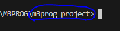
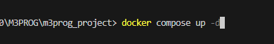
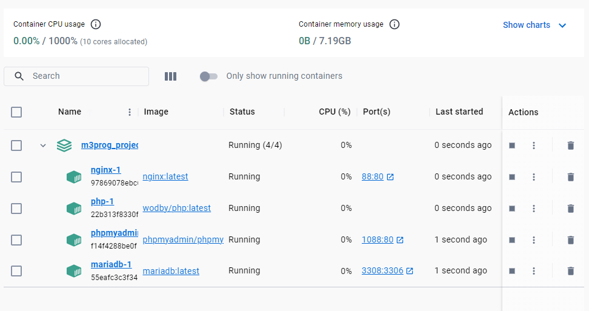
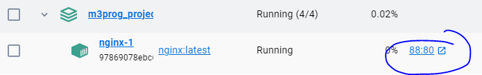
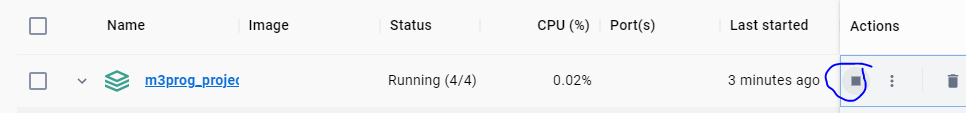

## Docker
- lees:
> Wij werken weer met docker containers voor de web based applicatie. In het document `docker-compose.yml` gaan wij de structuur aanmaken van dit project.

- open `docker-compose.yml`
  - zet daar het volgende in:
    ```yaml
    version: '3.9'
    services:
    ```

## php

- lees: 
  > Binnen de services gaan wij verschillende services toevoegen. Let hierbij op het `inspringen` van de code.

- Maak een php service aan in je `docker-compose` file:
  ```yaml
    # PHP FPM Service
    php:
      image: wodby/php:latest
      volumes:
        - './:/var/www/html'
      depends_on:
        - mariadb
  ```

## nginx

- Maak een nginx proxy service aan in je `docker-compose` file:
  ```yaml
    # Nginx Service
    nginx:
      image: nginx:latest
      ports:
        - 88:80
      links:
        - 'php'
      volumes:
        - './:/var/www/html'
        - './docker/nginx:/etc/nginx/conf.d'
      depends_on:
        - php
  ```

## mariadb

- Maak een MariaDB database service aan in je `docker-compose` file:
  ```yaml
    # MariaDB Service
    mariadb:
      image: mariadb:latest
      environment:
        MYSQL_DATABASE: m3prog_db
        MYSQL_USER: m3prog_user
        MYSQL_PASSWORD: m3prog_pass
        MYSQL_ROOT_PASSWORD: R00tp@ss
      ports:
        - 3308:3306
  ```

## PhpMyAdmin

- lees:
  > Om eenvoudig de database te kunnen beheren maken wij gebruiken van een `phpmyadmin` service. Maar je kunt ook via poort `3308` verbinden met een  externe tool zoals `Mysql workbench`, `heidisql` of `sequelAce`.  
  > Gebruik de root ( admin user ) gegevens om in te loggen zodat je straks meer rechten hebt

- voeg het volgende toe aan je `docker-compose` file:
  ```yaml
    # phpmyadmin in an external image
    phpmyadmin:
      image: phpmyadmin/phpmyadmin
      environment:
        PMA_HOST: mariadb
        PMA_USER: root
        PMA_PASSWORD: R00tp@ss
      ports:
        - "1088:80"
  ```

## nginx conf
- lees:
  > Nu je de docker klaar hebt staan kun je de `nginx.conf` instellen. Dit is de webserver die onze html en php gaat HOSTEN

- Plaats daarvoor deze code in de `/docker/nginx/nginx.conf`
  ```apacheconf
  server {
      listen 80 default_server;
      listen [::]:80 default_server;
      
      server_name localhost;

      root /var/www/html/public;
      index index.php index.html;

      # Support Yii2 pretty URL routing
      location / {
              try_files $uri $uri/ =404;
              if (!-e $request_filename){
                      rewrite ^/(.*) /index.php?r=$1 last;
              }
      }

      location ~* \.php$ {
          fastcgi_pass php:9000;
          include fastcgi_params;
          fastcgi_param SCRIPT_FILENAME $document_root$fastcgi_script_name;
          fastcgi_param SCRIPT_NAME $fastcgi_script_name;
      }

      # Prevent additional headers like TRACE, DELETE, PUSH
      if ($request_method !~ ^(GET|HEAD|POST)$ )
          {
              return 405;
          }
  }
  ```

## Start het project


- Zorg dat DockerDesktop aan staat
- open je visual studio code en open je m3prog_project als folder
  > 
  - rechter muis op het `docker-compose.yml`
    - click op `open in intergrated terminal`


- Start docker: `docker-compose up -d`
  > 

- controlleer je docker desktop:
  > 
  - Zie je dat de container  `m3prog_project` groen is?

- Open [http://localhost:88](http://localhost:88) in de browser
  - nu zie een wit scherm omdat de `/public/index.php` leeg is
  > - je kan ook op de `88:80` link in docker clicken
  >   


## Spelen met docker

- lees:
  > Wat als er nou iets mis gaat? kan je de container starten en stoppen?
  > Hoe makkelijk is het om een container opnieuw te maken?


- Click op de stop knop van  `m3prog_project`
  >   
  > - Nu heb je alles gestopt
  > - In jouw project hangen 4 containers
  
## Commit

- Zorg ervoor dat je alle wijzigingen commit
