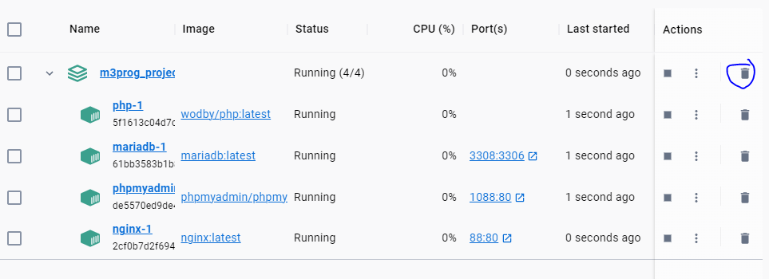
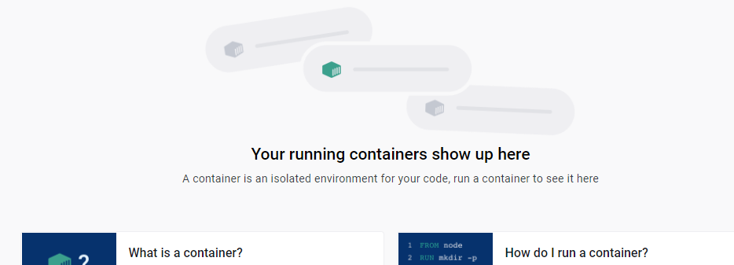
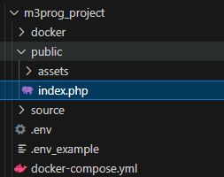

## Spelen met docker

> Wat als er nou iets mis gaat? kan je de container starten en stoppen?
> Hoe makkelijk is het om een container opnieuw te maken?

## start stop

- Click op de `stop` knop van  `m3prog_project`
  > 
  > - Nu heb je `alles` gestopt
  > - In jouw project hangen `4 containers`
 - maak een screenshot van je `docker desktop`:
    - `nothing runs.png`
    - zet deze in je `screenshots` directory

- start nu alles weer:
  > 

- stop nu 1 container de `nginx`:
  > 
  - Open [http://localhost:88](http://localhost:88) in de browser
    - je krijgt nu geen resultaat, want je webserver is `down`
  - maak een screenshot van je `docker desktop`:
    - `no nginx.png`
    - zet deze in je `screenshots` directory

- start je `nginx` weer

## Container deleten

- druk nu op de `delete` knop van je project:
  > 
  - controlleer of `m3prog_project` weg is:
  > 

- controlleer of je `index.php` nog op je hardeschijf staat:
  > 
  > onze `files` hangen buiten de container dus `geen probleem` als je de container delete

## opnieuw maken

- maak de containers `opnieuw`:
  - gebruik `docker compose up`

- Open [http://localhost:88](http://localhost:88) in de browser
    - je krijgt nu weer je index
    
## Commit

- Zorg ervoor dat je alle wijzigingen commit
