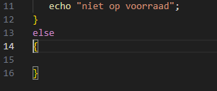
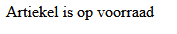
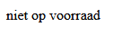
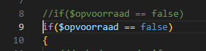
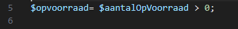

# If else statement

- we gaan verder in:
    - `if.php` 
        - in de directory `public/03`

- lees:
    > aan elke if MOGEN we ook een else koppelen, de code in de body van de else wordt uitgevoerd ALS de test tussen de if () uitkomt op FALSE

    ```php
    if(false)//() komt uit op false
    {
        // dit wordt NIET uitgevoerd
    }
    else
    {
        //nu gaat deze code uitgevoerd worden
    }
    ```

- geef de opvoorraad if een else:
    > 

- zet daar nu een echo in:
    - Artiekel is op voorraad

## Test

- test of de code werkt als:
    - aantalOpVoorraad groter dan 0
        > 
    - aantalOpVoorraad 0 is
        > 
    - aantalOpVoorraad kleiner dan 0 is
        > 
 

## direct testen

- zoek je if, kopieer die regel en plak die onder zichzelf
    - zet nu 1 van de regels even in commentaar
    > 
    - haal nu alles weg tussen de () van de if
    
- we gaan nu deze code gebruiken:
    > 
    - zie je het gedeelte ```$aantalOpVoorraad > 0```?
        - zet dat tussen de () van de if
            - dus zet  ```$aantalOpVoorraad > 0``` tussen de () haakjes

## test je code weer

- doet alles het nog?

## klaar
- commit alles naar je github

