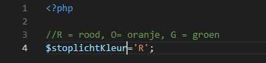
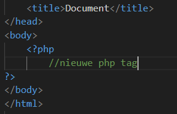
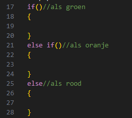

# If else statement

- Maak een nieuw bestand:
    - `elseif.php` 
        - in de directory `public/03`
- zet daar de standaard html in

## stoplicht

- maak nu een stoplichtKleur variabel
    >


## php tussen de html

- maak in je html body een nieuwe php tag, en sluit die
    >

- lees:
    ```
    nu kunnen we dus op 2 plaatsen php code maken:
    - boven de html
    - in de body van de html
    ```
## else if

- in de nieuwe php tag (in je body) maken we:
    - een if, met een else if en een else:
        >


## kleuren
- zet echo's in alle bodies:
   ```Html
    <button style='background-color:#FF0000;height:25px;width:25px;'/>
    ```
    - verander de kleur (#FF0000) voor oranje en groen


## if tests

- vergelijk nu stoplichtKleur met de letters:
    - 'G'
    - 'O'

## testen

- test alle kleuren door stoplichtKleur aan te passen

    >  
    >  
    >
    
## klaar
- commit alles naar je github

