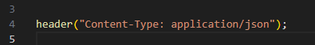

## Eigen array

- maak een nieuwe file:
    - `jsoninphp.php`
        - in de directory `public/06`

## Json header

- lees:
    > als wij json als php resultaat willen teruggeven moeten we een aantal stappen doorlopen:
    > - zet de httpresponse `Content-Type` header op:
    >   - `application/json`
    > - echo of print een string:
    >   - welke als json gelezen kan worden

- laten we een begin maken:
    - we zetten de header even als eerst:
        > 

## test

- open jsoninphp.php
    - een leeg scherm? dat klopt
        - maar open even de network debugger:
            > 
        - zie je dat daar nu json staat?

## geen header

- zet de header even in commentaar
- test nogmaals met de network debugger
    > 

## iets meer sturen

- laten we nu string die als json gelezen kan worden:
    - maak een variable:
        - steden
            - geef deze de waarde:
                > 

## echo!

- echo nu de steden variable
    - NA de header te zetten

## Test

- test:
    - nu ziet je browser dit als json:
        > 
    - haal nog eens de header weg en test:
        > 

    
## klaar
- commit alles naar je github
