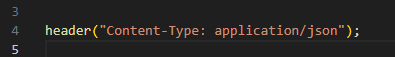
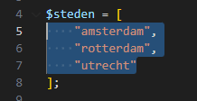
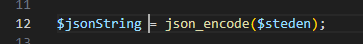
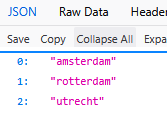

## Objecten naar json

- maak een nieuwe file:
    - `jsonObject.php`
        - in de directory `public/06`

## Json header

- we zetten de header weer even als eerst:
    > 

## naar json omzetten

- lees:
> - we hadden zelf onze json gemaakt als string
>   - leuk voor kleine data, maar veel werk als we meer hebben
> - Dat kan ook anders:
>   - een php variabel/object kan je naar json omzetten
>   - dit noemen we serialisation
> - daar gebruiken we de function `json_encode` voor

## Data
- laten we nu een array met strings sturen:
    - maak een variable:
        - steden
            - zet in de array de volgende steden in:
                - amsterdam
                - rotterdam
                - utrecht
                    > 
                
## Serialize!

- maak deze code na:
    > 

- echo jsonString

## test:

- test wat je krijgt!
    > 

## klaar
- commit alles naar je github
