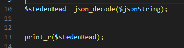
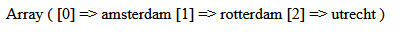
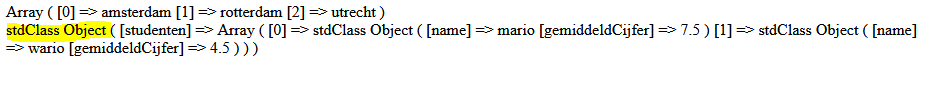
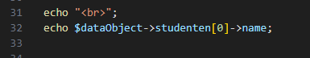
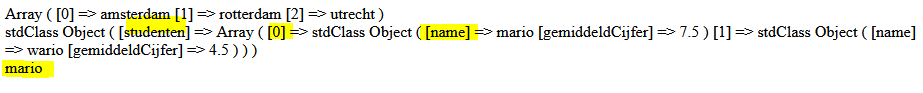
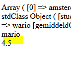

## Objecten naar json

- maak een nieuwe file:
    - `readjson.php`
        - in de directory `public/06`


## steden

- pak weer je steden array en maak daar json van:
    > 

- lees:
    > - nu hebben we de json
    > - wat als we die terug willen veranderen naar iets wat we in php kunnne gebruiken?
    >   - dan deserializen we de string met `json_decode`

## Deserialize

- maak de volgende code na:

    > 

- test je code:
    > 
    - nu hebben we onze array weer!

## ingewikkeldere data

- zet deze code in je file
```php
$json = '{
  "studenten": [
    {
      "name": "mario",
      "gemiddeldCijfer": 7.5
    },
    {
      "name": "wario",
      "gemiddeldCijfer": 4.5
    }
  ]
}';
```
- bekijk de json goed

- lees:
    > zie je dat we een array hebben? en dat die studenten heet?
    > - zie je dat we in die array 2 studenten tussen `{}` hebben staan?
    >     - dat zijn 2 json objecten
    > - en die elke van die objecten heeft variabelen:
    >       - name  
    >       - gemiddeldCijfer 
    
## deserialize

- deserialize $json naar een variable $dataObject
- print_r de $dataObject variable

- test!
    > 

- lees:
    >    - zie je dat daar stdClass Object staat?
    >       - dat is een php class

## studenten naam

- lees:
> - hoe komen we nu bij de name van 1 student?
>   - eerst gaan we naar $dataObject
>       - dan kunnen we met `->` bij studenten komen
>           - dat is een array, en de eerste is dus [0]
>           - dan weer met `->` naar name


- maak dit na:
    > 

- test:
    > 

## zelf proberen

- zet nu het gemiddeldeCijfer van wario op het scherm!

    > 


## klaar
- commit alles naar je github
