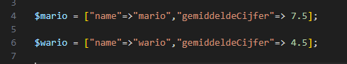
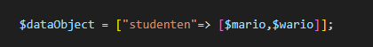
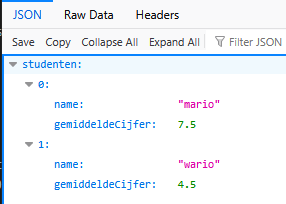
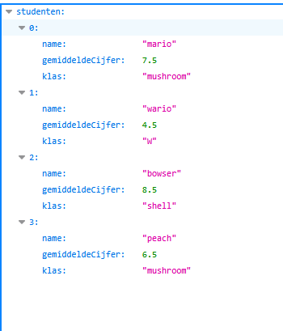

## Objecten naar json

- maak een nieuwe file:
    - `datametarray.php`
        - in de directory `public/06`

## Json header

- we zetten de header weer even als eerst:
    > 

- lees:
    > - wat als we nu een ingewikkelde data (zoals bij IOT) hebben en dat in php willen opbouwen?
    >   - dan zijn er 2 manieren:
    >       - de associative array (dictionary zoals in c#)
    >       - een php class/stdClass object

# Associative array

## Data
- we maken eerst de 2 studenten aan als variablen:
    > 

- nu maken we een dataObject aan met een array die studenten heet:
    > 

- serialize $dataObject naar een jsonString
- echo die string

## test

- test je code:
    > 

## meer studenten

- maak nog 2 studenten:
    - bowser
    - toad

- geef alle studenten ook een klas!
    > 

## klaar
- commit alles naar je github
