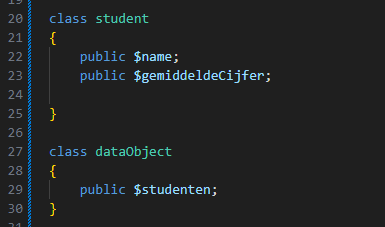
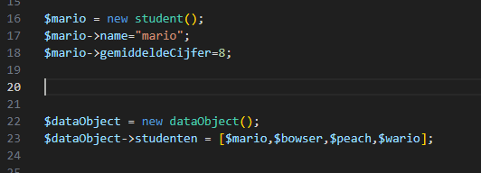
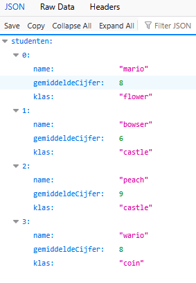
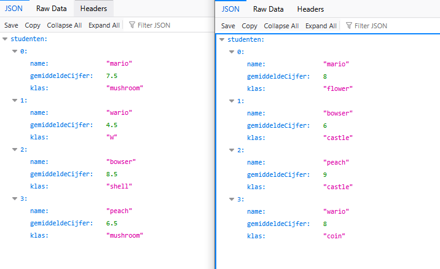

## en als class?

- maak een nieuwe file:
    - `dataclass.php`
        - in de directory `public/06`

- eerst maken we classes om data op te slaan:
    > 
- daarna bouwen we de data en linken het aan elkaar:
    > 

- maak ook wario, bowser en peach aan

- voeg ook de klas per student toe
- zet het op het scherm!

## test!

- test
    > 

- zie je dat de json hetzelfde is (misschien behalven de waardes) als die van de associative array?
    > 

## klaar
- commit alles naar je github
