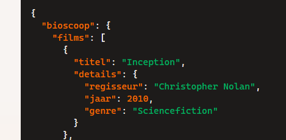

## Datastructuren

- maak een nieuwe file:
    - `datastructuren.php`
        - in de directory `public/06`


## Maak

- maak zelf een php data structuur met een associative array volgens de specificaties:
    - een films collectie
    - een film heeft een: title en details
    - in details zitten regisseur, jaar en genre
- voorbeeld json:
    > 

- vul, serialize en zet op het scherm

## test 

- test!
    - controlleer of jou json hetzelfde is
        > 
    

## Anders om!


- maak een nieuwe file:
    - `winkeldata.php`
        - in de directory `public/06`
- zet deze json in je php
```php

$winkel='{
  "winkel": {
    "producten": [
      {
        "productNaam": "Laptop",
        "details": {
          "prijs": 999.99,
          "voorraad": 50
        }
      },
      {
        "productNaam": "Smartphone",
        "details": {
          "prijs": 699.99,
          "voorraad": 100
        }
      }
    ]
  }
}
';
```

## uitvragen

- deserialize met json_decode naar een variable winkelObj
    - zet de prijs van de smartphone op het scherm
    - zet de voorraad van de laptop op het scherm
    - op deze manier:

        > 
        
## klaar
- commit alles naar je github
