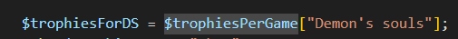

# Associatieve arrays

- bekijk dit code voorbeeld:

### Opdrachten

- Maak een nieuwe bestand:
  - `assoc_intro.php`
    - in de directory `public/07`
  
- maak daar deze code na:
    > 

## key/value
- lees:
 >  - een associative array heeft:
 >   - een key (de index) 
 >   - en een value, de waarde die bij de key hoort
 >   
 > - in de array die wij gemaakt hebben:
 >   - zijn "Demon's souls", "Mario wonder" en "Rayman Origins" de keys
 >   - 11,0 en 9 zijn de waardes
  
  
## ophalen met de sleutel (key)

- maak de volgende code na

  > 
  > - Dit haalt het aantal trophies voor demon's souls op

- zet nu het aantal trophies op het scherm
  > 

- haal nu ook mario wonder & rayman origins op
  - zet ook deze op het scherm:
    > 

## Verkeerde key

- haal nu `tetris` op
    > 

- test:
    > 

- dat werkt niet, los het op door tetris in de array te stoppen
  > gewoon aan het begin van je code waar de array gemaakt wordt

- test nogmaals:
    > 

## klaar
- commit alles naar je github
