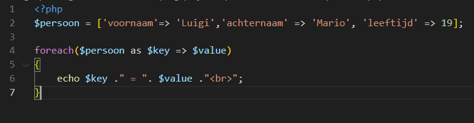
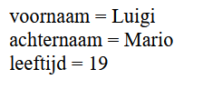
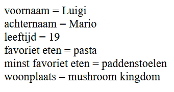
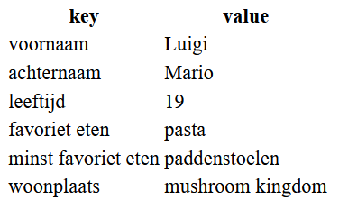
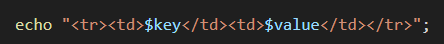
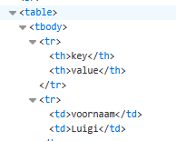

# UITLEG: Foreach loop door een array

- lees:
    > - De elementen in een normale array kun je dus ophalen met de index (die bij 0 begint)
    > - In een *associatieve array* gebruik je een eigen *key* voor de *value* die er bij hoort.
    > - Zo kun je direct iets ophalen waarvan je de *key* al weet.

## loopen over een associative array

- bekijk dit voorbeeld van een foreach:
    > 
- lees:
    > De foreach-loop geeft je elke keer de *key* EN de *value* die bij die key hoort:

## proberen

- Maak een nieuw bestand:
    - `personen.php`
    - in de directory `public/07`
- maak het voorbeeld na en test:
    > 

## meer keys

- voeg nu meer keys met values toe:
    - woonplaats
    - favoriet eten
    - minst favoriet eten
- test!
    > 

## tabel

- lees:
    - [hoe je een table maakt](https://developer.mozilla.org/en-US/docs/Learn/HTML/Tables/Basics#active_learning_creating_your_first_table)

 - maak nu een tabel met de persoon:
    > er staan ook hints hieronder  
    > 

- hints:
    >   
    > 
 
## klaar
- commit alles naar je github