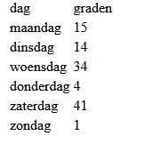
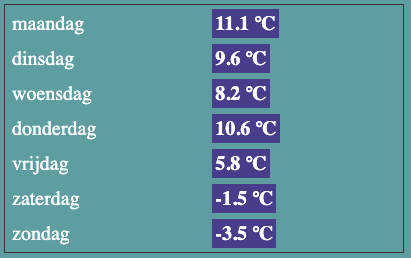
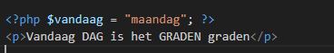
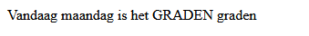
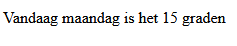
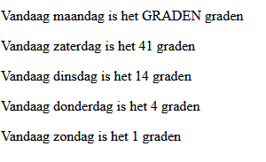

### Zelf een associative array maken

- Maak een nieuwe bestand:
  - `array_assoc.php`
    - in de directory `public/07`

## html
- zet daarin een HTML start document en zet alle PHP-code weer in de `<body>` van je HTML (en tussen de start en eind PHP-tags uiteraard!)

## weer
- Zoek de weersvoorspelling voor komende week op internet.
- Maak nu een `associatieve array` met:
  - als `key` de weekdag 
  - en als `value` de temperatuur voor die dag 
  - verzin zelf een `duidelijke naam` voor de `array variabele`.
  
- Gebruik de `print_r()`function om de array op het scherm te zetten.

## Tabel maken:
- Maak nu in de HTML:
   - een [table](https://developer.mozilla.org/en-US/docs/Learn/HTML/Tables/Basics#active_learning_creating_your_first_table) met
    - voor elke dag een rij. 
    - Zet in kolom 1 de naam van de dag
    - Zet in kolom 2 de temperatuur van de dag
      > 
    

## opleuken:

- Voeg een CSS-bestand toe en maak het mooier qua kleuren, lettertype etc. 
  > Je kunt bijvoorbeeld de `table` en `td` een kleurtje geven. Of zet de temperatuur tussen `` en gebruik CSS om de temperatuur een eigen stijl te geven.   

- voorbeeld:
  - Zoiets zou je dan kunnen krijgen:
  > 

## ophalen met de sleutel (key)

- We maken een nieuw stukje HTML:
  - we voegen een `P` toe met tekst:
  > ;
- `vervang` nu `DAG` met:
  - `<?= $vandaag;?>`
  - je ziet nu dit in je browser:
  > 
- `vervang` nu `GRADEN` door de `waarde` die aan `maandag gekoppeld` zit!
  - je ziet nu dit in je browser:
  > 

- toon nu 4 andere dagen (*kies zelf*) op dezelfde manier:
  > 

## klaar
- commit alles naar je github
