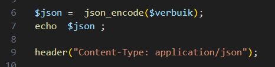
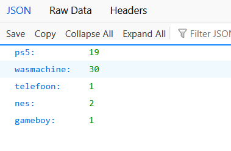
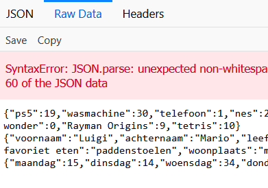
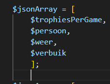
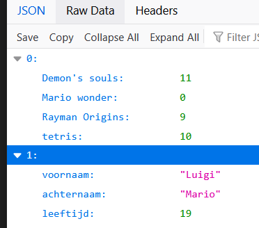
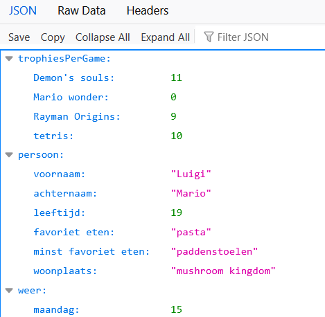

# Json

- lees:
    ```
    json hebben we al eerder gebruikt, maar nu we associative arrays kennen kunnen we makkelijk json maken
    ```

## verbruik

- Maak een nieuwe bestand:
  - `assocjson.php`
    - in de directory `public/07`

- zet daar je $verbruik associative array uit `associatief.php` in

- zet nu daar de volgende code in:
    > 
- test:
    > 


## meer json

- kopieer je andere arrays ook in dit bestand
    - $weer
    - $persoon
    - $trophiesPerGame 
- zet die ook op het scherm met code zoals je met verbuik gedaan hebt

## test?

- test:
    > 

- oof dit werkt niet?
    - waarom:
    ```
    we zetten nu meerder json onder elkaar, dat is geen valide json
    - json mag alleen beginnen met 1 object (zoals $verbruik)
    - OF een array met objecten daarin
    ```
## oplossen

- nieuwe array!:
    - maak deze code, en zet ALLEEN die op het scherm
        > 
    - test!
        > 

## index?

- indexen met verschillende objecten voelt nog verkeerd
    - dus maak er een associative array van:
        > 


## klaar
- commit alles naar je github