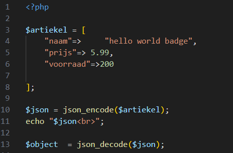
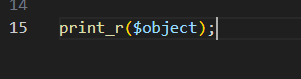

## classes

- Maak een nieuwe bestand:
  - `class.php`
    - in de directory `public/08`

## json

- we gaan nu even van een associative array naar json en terug:
  - maak deze code na:

      > 

- beantwoord de volgende vraag
  - wat verwacht je dat het $object nu is?
  - zet die in commentaar in je code

## test!

- zet de volgende code erbij:
    > 

- test:
    > 
- lees:
  >  - dat is geen associative array?
  > - wat is een stdClass?
  >   - eigenlijk gewoon een class net als in andere talen
  >     - dus een code `doos` waar je eigenschappen en functions aan hangt

## klaar
- commit alles naar je github