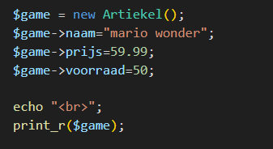

## verbruik

- Maak een nieuwe bestand:
  - `artiekel.php`
    - in de directory `public/08`

## eigen class maken

- laten we artiekel eens als class schrijven:
    > 
  
- en nu maken we 1 instance aan van die class:
  - zet die ook meteen op het beeld
    > 

## test

- test:
    > 
- vergelijk met de het json resultaat
    > 
- lees:
  > - zie je dat de json bijna hetzelfde is?
  > - op het stdClass en Artiekel woord na?

## json

- maak nu van $game json en zet het op het scherm
    > 
- lees:
  > - dat ziet er bekend uit toch?
  > - daar begonnen we mee vanuit de associative array

## klaar
- commit alles naar je github