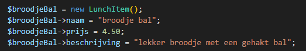
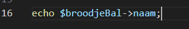
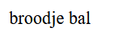
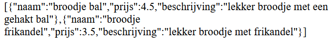

## verbruik

- Maak een nieuwe bestand:
  - `eigenschappen.php`
    - in de directory `public/08`

## json

- maak een nieuwe class
    > 

- maak een nieuwe instance:
    > 

- lees:
    > - zie je dat we met -> bij elke eigenschap van de instance komen?
    > - in dit geval geven we een waarde aan die class variable 

## op het scherm zetten

- laten we de naam met een echo op het scherm zetten:
    > 
- test:
    > 

## de rest

- zet nu de rest ook op het scherm:
    > 

## kaal menu

- maak nu een tweede lunch item en zet ook die op het scherm:
    > 

## array

- zet nu je 2 lunch items in een array
  - maak daar json van 
    - zet dat op het scherm
    > 

## loop

- loop nu over die array heen met een foreach:
    > 
  - zet alles netjes op het scherm met html:
    - hint: gebruik `$item->`
    > 
  
## klaar
- commit alles naar je github