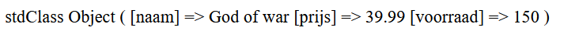
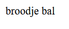
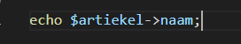
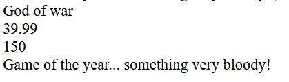
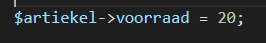
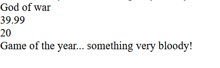
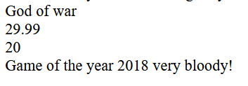
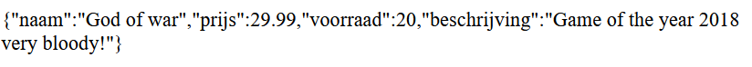

## verbruik

- Maak een nieuwe bestand:
  - `back2json.php`
    - in de directory `public/08`

## json

- zet daar deze json in:
```php
$json = '{"naam":"God of war","prijs":39.99,"voorraad":150}';
```

- maak daar een object van en zet die op het scherm:
    > 
  

## stdClass

- lees:
> - daar is de stdClass weer, hoe komen we bij de waardes van de eigenschappen?
> - net als bij een eigen class:  
>   

## proberen
- dat gaan we even proberen:
    - we beginnen met de naam:
        > 
    - doe de prijs en voorraad zelf

- stop zelf ook een beschrijving in de json en zet die op het scherm:
    > 

## veranderen

- verander nu de waarde van de voorraad naar 20:
    - voor het op het scherm zetten!
        > 
        > 
- verander ook de prijs naar 29.99
- en vul het jaar in

- test!
    > 


## naar json!

- maak er json van:
    > 


## wat hebben we nu geleerd?

- lees:
> wat we geleerd hebben is hoe we zelf:
> - een class kunnen maken
> - daar json van kunnen maken
> - hoe we eigenschappen kunnen uitlezen en veranderen
> - dit is de opzet om met databases en api's te werken!

## klaar
- commit alles naar je github