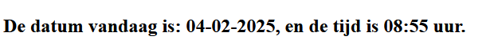

### Php + Html

- Maak nu een nieuw bestand `phphtml.php`

PHP en HTML kun je samen gebruiken. Dat maakt het heel krachtig omdat je zo dynamische code (PHP) kunt mixen
met gewone HTML-code.

Zet onderstaande code in het `phphtml.php` bestand en vraag het bestand op in je browser via de juiste http://localhost url.

```php
<!doctype html>
<head>
<title><?php echo "Titel van de pagina" ?></title>
</head>
<body>
    <h2>De datum vandaag is: <?php echo date('d-m-Y')?>, en de tijd is <?php echo date("H:i")?> uur.
    <p>Tellen kan ook:</p>
    <ol> 
    <?php for($i=0; $i < 100; $i++):?>
        <li><?php echo $i; ?></li>
    <?php endfor;?>
    </ol>
</body>
</html>
```

- check of je ongeveer dit ziet:
    > Voorbeeld:  
    > 


- Maak een `screenshot` van de output en zet deze in de directory:
    - `M3Prog/screenshots`
    - noem de file `phphtml.png`


## klaar?

- commit alles naar je github


 


