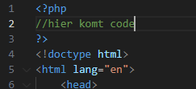
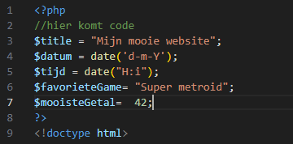

### Php + Html

- Maak nu een nieuw bestand `phphtml.php`
    - in de directory `public/01`

- lees:
    > PHP en HTML kun je samen gebruiken. Dat maakt het heel krachtig omdat je zo dynamische code (PHP) kunt mixen
    > met gewone HTML-code.

- Zet onderstaande code in het `phphtml.php` bestand
    ```php
    <!doctype html>
    <html lang="en">
        <head>
            <title><?php echo "Titel van de pagina" ?></title>
        </head>
        <body>
            <h2>De datum vandaag is: <?php echo date('d-m-Y')?>, en de tijd is <?php echo date("H:i")?> uur.
            
            <p><h2>Mijn favoriete game</h2><?php echo "Super metroid";?></p>
        </body>
    </html>
    ```
- vraag het bestand op in je browser via de juiste http://localhost:88 url.
    - check of je zoiets krijgt:
    > 

## Php code block:

- maak een nieuwe file:
    - `phphtml_var.php`
- zet alle code van `phphtml.php` daar in
- Zet nu boven de doctype een php open en sluit tag:
    > 

## variabelen maken
- lees:
    > een variable in php maak je door:
    > - een $ te schrijven 
    > - en daarna de naam van de variabel
    > - en dan een = met de waarde  
    > bijvoorbeeld:
    ```php
    $leeftijd = 99;
    ```

- nu maken we daar een aantal variablenen:
    > 

- lees:
> - nu we variabelen hebben kunnen we die gebruiken in de html of in php code 
- hoe zetten we een variable op het scherm?
    > 
    > 
    
- Zet onderstaande code in het `phphtml.php` bestand
    ```php
    <!doctype html>
    <head>
    <title><?php echo "Titel van de pagina" ?></title>
    </head>
    <body>
        <h2>De datum vandaag is: <?php echo date('d-m-Y')?>, en de tijd is <?php echo date("H:i")?> uur.
        <p>Tellen kan ook:</p>
        <ol> 
        <?php for($i=0; $i < 100; $i++):?>
            <li><?php echo $i; ?></li>
        <?php endfor;?>
        </ol>
    </body>
    </html>
    ```
- vraag het bestand op in je browser via de juiste http://localhost:88 url.


- check of je ongeveer dit ziet:
    > Voorbeeld:  
    > 

## klaar?

- commit alles naar je github


 


