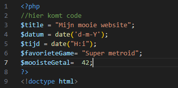

## Php code block:

- maak een nieuwe file:
    - phphtml_var.php
- zet alle code van phphtml.php daar in
- Zet nu boven de doctype een php open en sluit tag:
    > 

## variabelen maken
- lees:
    > een variable in php maak je door:
    > - een $ te schrijven 
    > - en daarna de naam van de variabel
    > - en dan een = met de waarde  
    > bijvoorbeeld:
    ```php
    $leeftijd = 99;
    ```

- nu maken we daar een aantal variablenen:
    > 


## klaar?

- commit alles naar je github


 


