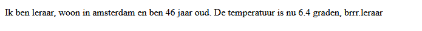

## Maak een aantal variabelen en zet ze op het scherm

- lees:
> Je weet nu hoe je een variabele maakt met PHP en welke verschillende data types er zijn (zoals int en string)

- Maak een bestand `variabelen.php`
    - in de directory `public/01`
- Zet nu boven de doctype een php open en sluit tag:
    > 
- maak tussen de php tag de 4 variabelen maken
    - kies de juiste data-types *(dus niet alles een string)* 
    - kies zelf een duidelijke naam voor de variabele
    - maak deze variablen aan:
        - Je naam
        - Je woonplaats
        - Je leeftijd
        - De huidige temperatuur met 1 cijfer achter de komma
            > HINT:  Vergeet de `;` niet aan het einde van elke regel PHP.

## HTML

- Maak in het PHP-bestand eerst een standaard HTML-document structuur.
    > dus html, head, body tags etc...
- Maak nu met PHP en HTML een lopende zin waarbij je alle variabelen gebruikt. 
    > Bijvoorbeeld: "Ik ben Leraar, woon in Amsterdam en ben 46 jaar oud. De temperatuur is nu 6.4 graden, brrr."

### TEST

- Vraag de pagina op via localhost om je code te testen  
    - check of je zoiets krijgt:
    > 

## klaar
- commit alles naar je github

