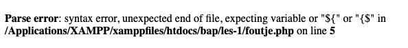

## Foutmelding testen

> Je gaat nu expres een fout maken om te kijken of je nu de foutmeldingen krijgt te zien

- Maak een nieuw bestand: `foutje.php`
- Schrijf de start en eind PHP tags die je inmiddels kent
- Zet tussen de PHP-tags deze code:

```php
echo "Dit is foute code omdat de quotes niet dezelfde zijn';
echo 100/0; // Hier wordt door nul gedeeld, dat is ook een fout!
```

- Open dit bestand via je localhost:88
    - als het goed is zie je nu een foutmelding:
    > 
- maak een screenshot van je `resultaat`:
    - `foutje.png`
    - zet deze in je `screenshots` directory

## andere fout

- maak een nieuwe php:
    - `fout2.php`

```php
echo "dit is goed toch?"
```

- Open dit bestand via je localhost:88
    - als het goed is zie je nu een foutmelding:
    > *Parse error: syntax error, unexpected end of file, expecting "," or ";" in /var/www/html/public/fout2.php on line 2*  
    > Dit betekent dat je je `;` vergeten bent

- maak een screenshot van je `resultaat`:
    - `foutje.png`
    - zet deze in je `screenshots` directory
    
- fix nu de fout
    - probeer het nogmaals


> LEES de fouten goed, er zit altijd een hint in wat je moet doen:
> - de regelcode `on line 2`
> - wat voor fout het is:
>       - `unexpected end of file, expecting "," or ";"`


## klaar
- commit alles naar je github

