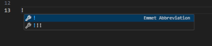
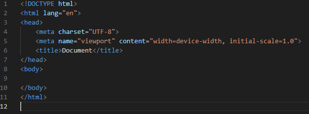
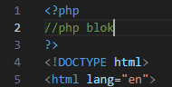
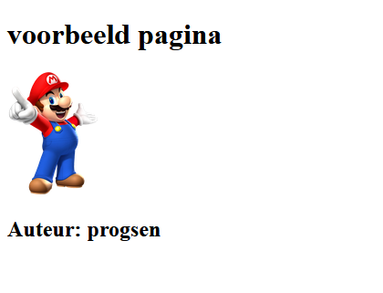

# PHP en HTML combineren

#### UITLEG
> De kracht van PHP is dat je het kunt combineren met HTML.
> 
> Wil je PHP-code schrijven die iets doet? Je opent een PHP tag, schrijft de > PHP-code en sluit af met de eind PHP-tag.  
>  
> **Je kunt op ELKE plek een PHP tag openen en iets in de HTML zetten!**

*Voorbeeld:*
```php
<?php
$image = "https://www.amsterdamsdagblad.nl/image/1659_1747_1200_1200.jpg";
$titel = "Mediacollege Amsterdam";
?>
<h1><?php echo $titel; ?></h1>
" alt="<?php echo $titel?>" />
 ```

## File maken

- Maak een nieuw bestand:
  - `php-en-html.php`
    - in de directory `public/02`
- type in Visual Studio Code: 
  - `! + TAB`
    > 
    - nu krijg je een html start
    > 


## Php code

- voeg een php blok toe:
    > 

- Maak bovenin in een PHP blok:
  - `3 variabelen`
    > - Voor de `titel` van de pagina
    > - Voor de `URL` naar een `afbeelding` van het internet
    > - Voor de `titel` van de afbeelding
    > - Voor `auteur`:
    >     - met waarde:jouw eigen `githubnaam` 

## Echo in html UITLEG


> er zijn 2 manieren om php variabelen in je html te krijgen
> - in het voorbeeld hieronder zetten we:
>     - in de HTML tag `<main>`:
>         - de waarde van $mijnVariable;
#### lange versie
```php
<main>
<?php echo $mijnVariable;?>
</main>
```
#### korte versie
```php
<main>
<?= $mijnVariable;?>
</main>
```

## opdracht echo in html:

- Gebruik `echo` om (de lange versie):
  > - de **variabelen** op de juiste plek in de HTML uit te voeren met PHP:

    - Gebruik de `image url` *(de variabele dus!)* in een `` tag.
    - Gebruik de `titel` *(de variabele dus!)* van de image in het `alt` en/of `title` attribuut van de `img` tag.

- maak in html een `<section>`
  - zet hier een title in waarin staat:
    - `Auteur: ...`
- gebruik nu de `korte versie` om:
    - de `...` te vervangen met `auteur` *(de variabele dus!)*

- Open je `php-en-html.php` in je browsers *(vergeet docker niet)* en:
    - kijk of de pagina uitvoer correct is:
        > onze oplossing ziet er bijvoorbeeld zo uit:
        > 

## screenshot

- Maak een screenshot van de pagina
  - noem die: `02phphtml.png`
    - zet deze in je `screenshots` directory


## klaar
- commit alles naar je github
