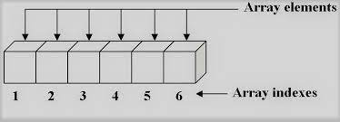
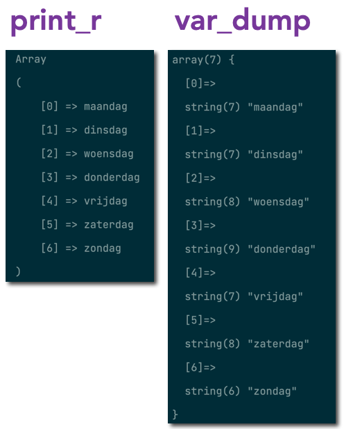

## Arrays

- maak een nieuwe file:
    - `arrays_uitleg.php`
        - in de directory `public/03`
- Lees de uitleg hieronder
    - en maak de opdrachten


# UITLEG: Wat zijn Arrays? 

- lees: 
    > In een array kun je lijsten / verzamelingen gegevens opslaan. Denk aan een lijst met temperaturen, namen, prijzen etc.
    > Een array bevat dus meerdere waarden en dat is handig. Je kunt al die waarden in één variabele opslaan.


## UITLEG: array maken

Zo maak je een array in PHP (beide regels doen `hetzelfde`, de tweede regel is wat minder typen):

```php
// Lege array maken (langere manier)
$data = array();

// Lege array maken (kortere manier)
$data = []

// Langere manier, met gegevens
$dagen = array("maandag", "dinsdag", "woensdag", "donderdag", "vrijdag", "zaterdag", "zondag");

// Verkorte manier, met gegevens
$dagen = ["maandag", "dinsdag", "woensdag", "donderdag", "vrijdag", "zaterdag", "zondag"];
```

## OPDRACHT

- maak nu zelf een array, kies een onderwerp:
    > - berichten
    > - games
    > - zangers
    > - youtubers
    > - streamers
   
- de `variable` waar de `array` in zit heeft de naam van 1 van onderwerpen hierboven
    > - voorbeeld: 
    > je kies `autos` dan heb je `$autos = ...`

- zet er `5 elementen` in (zie dagen)
    - print de array met `print_r`


## UITLEG: Elementen

- lees:
    > - Een element is `1 ding` wat in `1 hokje` van de array zit
    > - Het `1e element` in een array heeft `index 0`, het 2e index 1 enzovoorts. 
    > - een index is het `huisnummer` van het `hokje`


#### VOORBEELD:

- lees:
    > we hebben deze array:
    ```PHP
    $dagen = ["maandag", "dinsdag", "woensdag", "donderdag", "vrijdag", "zaterdag", "zondag"];
    ```

    > Om "donderdag" op te halen kun je de `index 3` gebruiken:
    > 

    ```php
    echo $dagen[3]; 
    // Er wordt "donderdag" op het scherm gezet
    ```


## OPDRACHT elementen

- echo nu het 3de en 5de element van jouw array in `arrays_uitleg.php` 
    - open je browser en check of je het op je scherm ziet
    - gebruik `echo "<br>";` om de regels onder elkaar te zetten

## UITLEG: Printen/Echo

- lees:
    > - Een array kun je **NIET** met `echo $namen` op het scherm zetten (zoals een tekst of een getal)   
    > - Je kunt wel `var_dump()` of `print_r()` gebruiken.

- Bekijk het php code voorbeeld hieronder:
    ```php
    // Print de array in tekst formaat
    print_r($dagen);   

    // Geeft wat extra info over het soort data dat er in zit
    var_dump($dagen); 
    ```
    > 

## Opdracht: Printen/Echo

- `print_r` je `array`
- `var_dump` je `array`
- `kijk` even naar het `verschil` in output


## klaar
- commit alles naar je github
