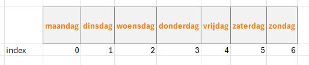

## Arrays

- maak een nieuwe file:
    - `arrays_uitleg.php`
        - in de directory `public/03`
- Lees de uitleg hieronder
    - en maak de opdrachten


# UITLEG: Wat zijn Arrays? 

> In een array kun je lijsten / verzamelingen gegevens opslaan. Denk aan een lijst met temperaturen, namen, prijzen etc.
> Een array bevat dus meerdere waarden en dat is handig. Je kunt al die waarden in één variabele opslaan.


## UITLEG: array maken

Zo maak je een array in PHP (beide regels doen `hetzelfde`, de tweede regel is wat minder typen):

```php
// Lege array maken (langere manier)
$data = array();

// Lege array maken (kortere manier)
$data = []

// Langere manier, met gegevens
$dagen = array("maandag", "dinsdag", "woensdag", "donderdag", "vrijdag", "zaterdag", "zondag");

// Verkorte manier, met gegevens
$dagen = ["maandag", "dinsdag", "woensdag", "donderdag", "vrijdag", "zaterdag", "zondag"];
```

## OPDRACHT

- maak nu zelf een array, kies een onderwerp:
    > - autos
    > - games
    > - zangers
    > - youtubers
    > - streamers
    - de `variable` waar de `array` in zit heeft de naam van 1 van onderwerpen hierboven
        > - voorbeeld: je kies `autos` dan heb je `$autos = ...`
    - zet er `5 elementen` in (zie dagen)
    - print de array met `print_r`


## UITLEG: Elementen

> - Een element is `1 ding` wat in `1 hokje` van de array zit
> - Het `1e element` in een array heeft `index 0`, het 2e index 1 enzovoorts. 
> - een index is het `huisnummer` van het `hokje`


#### VOORBEELD:

we hebben deze array:
```PHP
$dagen = ["maandag", "dinsdag", "woensdag", "donderdag", "vrijdag", "zaterdag", "zondag"];
```

Om "donderdag" op te halen kun je de `index 3` gebruiken:


```php
echo $dagen[3]; 
// Er wordt "donderdag" op het scherm gezet
```


## OPDRACHT elementen

- echo nu het 3de en 5de element van jouw array in `arrays_uitleg.php` 
    - open je browser en check of je het op je scherm ziet
    - gebruik `echo "<br>";` om de regels onder elkaar te zetten

## UITLEG: Printen/Echo/:og

> Een array kun je **NIET** met `echo $namen` op het scherm zetten (zoals een tekst of een getal)> 

Je kunt wel `var_dump()` of `print_r()` gebruiken.

```php
// Print de array in tekst formaat
print_r($dagen);   

// Geeft wat extra info over het soort data dat er in zit
var_dump($dagen); 
```


## Opdracht: Printen/Echo/:og

- `print_r` je `array`
- `var_dump` je `array`
- `kijk` even naar het `verschil` in output


## Andere functions

Er zijn veel [array functions](https://www.php.net/manual/en/ref.array.php) in PHP om met arrays te werken. Hier wat voorbeelden.


## UITLEG: Handige functions

> Dit zijn functions die heel veel gaat gebruiken
Gebruik [count()](https://www.php.net/manual/en/function.count.php) om het **aantal** elementen terug te krijgen:

```php 
echo count($dagen); 
// 7
``` 

Iets toevoegen aan een array kan met [array_push()](https://www.php.net/manual/en/function.array-push.php) of met de korte versie: `[]`

```php
// Lange manier
array_push($dagen, "nog een dag");

// Verkorte manier 
$dagen[] = "nog een dag";

De array $dagen wordt bevat nu een extra element
echo count($dagen); // 8
```

Met [implode()](https://www.php.net/manual/en/function.implode.php) kun je alle elementen aan elkaar plakken en omzetten in een string (met een scheidingsteken)

```php
echo implode(' >> ', $dagen);
// maandag >> dinsdag >> woensdag >> donderdag >> vrijdag >> zaterdag >> zondag >> nog een dag
```

Sorteren kan ook:

```php
// Sorteer op alfabet
sort($dagen);
echo implode(' >> ', $dagen);
// dinsdag >> donderdag >> maandag >> nog een dag >> vrijdag >> woensdag >> zaterdag >> zondag
```

En zo zijn er nog veel meer functies die je kunt gebruiken. Je vind ze in de documentatie :-)


## Opdracht: functions gebruiken

- gebruik `count` om de lengte van je array op het scherm te zetten

- voeg met `array_push` nog 1 element toe
    - `print_r` je array nogmaals
- `sort` je array 
    - `echo implode` nu met ` ` je array
- je krijgt dan ongeveer zoiets op je scherm:
    > 
    
## Documentatie
Hier vind je meer info over arrays en handige array functions in PHP:

- [https://code.tutsplus.com/tutorials/working-with-php-arrays-in-the-right-way--cms-28606](https://code.tutsplus.com/tutorials/working-with-php-arrays-in-the-right-way--cms-28606)
- [https://www.php.net/manual/en/language.types.array.php](https://www.php.net/manual/en/language.types.array.php)
- [https://www.php.net/manual/en/ref.array.php](https://www.php.net/manual/en/ref.array.php)

