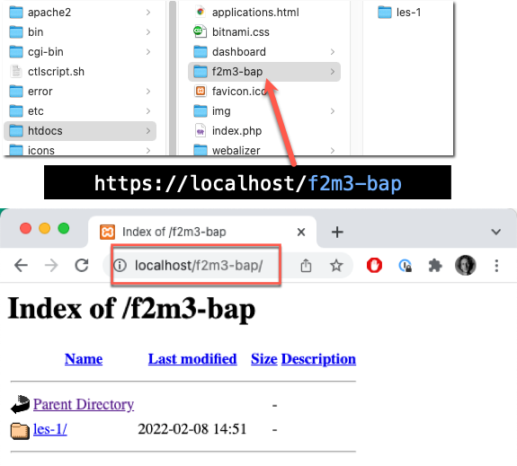
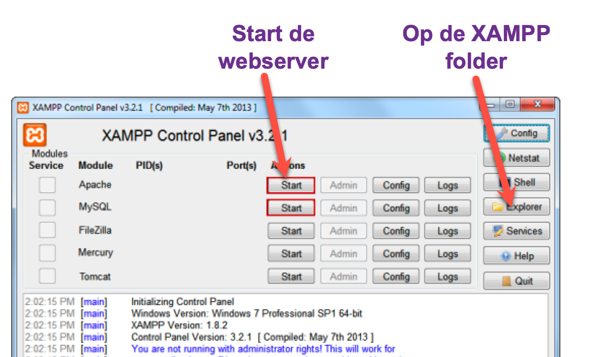
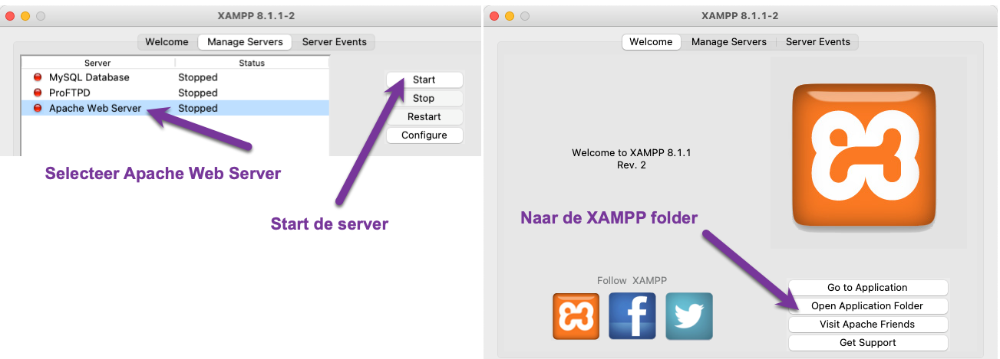

## Belangrijk

Zorg dat je vanaf nu werkt vanuit de map `htdocs` in de XAMPP folder van je webserver.
Alles wat daar in staat kun je bereiken in je browser via http://localhost

**Zet dus je HELE Backend programming repository in de `htdocs` map** (je mag die map hernoemen naar iets korters zodat je minder hoeft te typen). 

Als je jouw repository-map de naam `f2m3-bap` geeft dan kun je die dus opvragen via de webserver (localhost) op: [http://localhost/f2m3-bap](http://localhost/f2m3-bap) en vanaf daar is elke map een volgende `/`.  
De map `les-1` vind je dus op: [http://localhost/f2m3-bap/les-1](http://localhost/f2m3-bap/les-1)

---

### Windows - htdocs folder vinden
{: .text-blue-100 .fs-6 }

Op Windows kom je op deze manier bij de XAMPP hoofd folder. Ga vervolgens naar de htdocs folder en zet daar jouw BAP repository in.

---

### Mac - htdocs folder vinden
{: .text-blue-100 .fs-6 }

Op een Mac kom je op deze manier bij de XAMPP hoofd folder. Ga vervolgens naar de htdocs folder en zet daar jouw BAP repository in.

