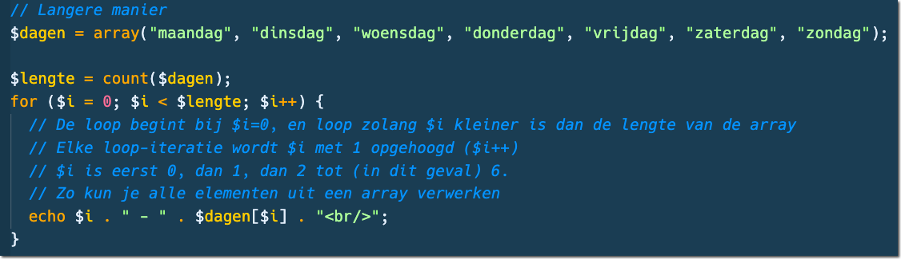

# For loop door een array

> Een for-loop gebruik je om een stuk code een aantal keren uit te voeren >(Bekijk de slides van Les 3!)  
> Je kunt een for-loop dus mooi gebruiken om elementen uit een array op het scherm te zetten. Je telt namelijk vanaf een start index, naar een eind index en telt elke keer 1 op bij de loop variabele.
> Die loop variabele (vaak $i genoemd) kun je dus gebruiken om het element op die array index op te halen.

**Voorbeeld**

### Opdrachten

- Maak een nieuw bestand:
    - `for-loop.php` met HTML structuur en zet de PHP-code weer tussen de `<body></body>`.
        - in de directory `public/03`

- Maak een array `$pokemons` met minstens 5 [Pokemon namen]
    - zie (https://www.pokemon.com/nl/pokedex/)
- Maak nog een array `$images`
    - zet daarin de image url van de pokemon
        > HINT right-click op afbeelding, kopieer afbeeldings-url
- Zorg dat:
    - op index 0 in de `$pokemons` array de naam staat
    - en op index 0 in de `$images` de afbeeldings-url.

- Schrijf een `for-loop` die telt van 0 tot de `lengte` van de array
    - HINT: `count`
- Gebruik in de loop `echo` en zet de naam tussen een `<h1></h1>` tag en de afbeeldings url in de `src` van een `` tag.
- Voeg wat `kleuren` en `stijlen` toe met een CSS-bestand
    - je style bestand moet in `assets/css/`

> Je hebt nu met een loop 5 of meer Pokemon characters en hun afbeelding op het scherm gezet in HTML.

## klaar
- commit alles naar je github

## extra info
Hier vind je meer info over de for-loop met voorbeelden:

- [Voorbeelden for loops](https://nl.wikibooks.org/wiki/Programmeren_in_PHP/Loops)
- [PHP Array functions](https://www.php.net/manual/en/ref.array.php)
- [PHP for-loop](https://www.php.net/manual/en/control-structures.for.php)

