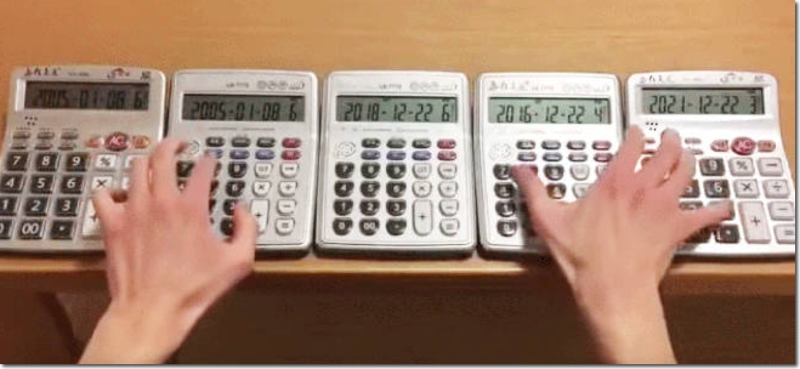

# Nu zelf oefenen en een function schrijven

> Je hebt nu flink wat info en voorbeelden hoe je functions zelf kunt schrijven

### Opdracht 1 - Schrijf een function voor het berekenen van vliegkosten

- Voeg nu een function aan `functions.php` toe die:
    - de retour prijs berekent (dus heen en terugreis samen) voor een vliegreis.
        - gebruik de onderstaande instructies:

        > **De function moet deze input argumenten/parameters gebruiken:**
        > 
        > - Afstand in kilometers
        > - Prijs voor een liter kerosine
        > - Hoeveel kilo bagage er mee gaat
        > - Of je business class of economy class reist
        >
        > **De berekening moet als volgt plaatsvinden:**
        > 
        > - De kosten voor de reis bereken je door de `kerosine prijs x het totaal aantal kilometers` te doen, en daarna `te delen door 30`
        > - Voor `elke kilo` bagage `tel` je `5 euro` op bij de kosten
        > - Reis je `business class` dan wordt de `totaalprijs` nog eens vermenigvuldigd met `1.5`

### Opdracht 2 - Gebruik de function en bereken kosten

- Maak een bestand `vliegkosten.php`
    - laadt met `include_once` je `functions.php` in.
- Test je function uit door hem aan te roepen in `vliegkosten.php`:
    > **Bereken nu de kosten door jouw eigen function te gebruiken**
    > 
    > - Vliegreis van 3722 km, Kerosine prijs 2.05, Bagage 20 kilo, Economy class
    > - Vliegreis van 9276 km, Kerosine prijs 3.11, Bagage 10 kilo, Economy class
    > - Vliegreis van 803 km, Kerosine prijs 2.83, Geen bagage, Business class

- Zet het resultaat op het scherm 
    - gebruik ook `number_format()` om af te ronden naar 2 cijfers achter de komma
    - en zet een € teken voor de kosten.

## TESTEN

- Vraag de pagina op via localhost
- Voeg wat `kleuren` en `stijlen` toe te voegen met CSS zodat het er prettig uit ziet.
- maak een screenshot als bewijs:
  - `04 vliegen.png`
  
> de uitkomsten zouden moeten zijn:
> - 3722 km: €354.34
> - 9276 km: €1,011.61
> - 803 km + business: €113.62 
## klaar
- commit alles naar je github

