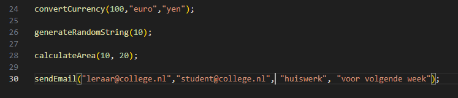
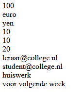

## oefenenen

- maak een nieuwe file:
    - `zelfmetargumenten.php`
        - in de directory `public/05`

## Maken

- schrijf deze function:
    > de body mag leeg blijven
    - convertCurrency
        - met argumenten:
            - amount
            - fromCurrency
            - toCurrency

- schrijf ook deze functions:
    > de body mag leeg blijven
    
    - sendEmail
        - met argumenten:
            - to
            - from
            - subject
            - message
    - generateRandomString
        - met argumenten:
            - length
    - calculateArea
        - met argumenten:
            - length
            - width  
    
## Body

- echo of print nu in de body de argumenten

## Gebruiken

- test nu de nieuwe functions:
    - roep de function aan in je code        
        >
    - check je resultaat:
        >

- lees:
    > deze functions doen nog niet veel, we hebben ze nog geen NUTTIGE code gegeven
    
## klaar
- commit alles naar je github
