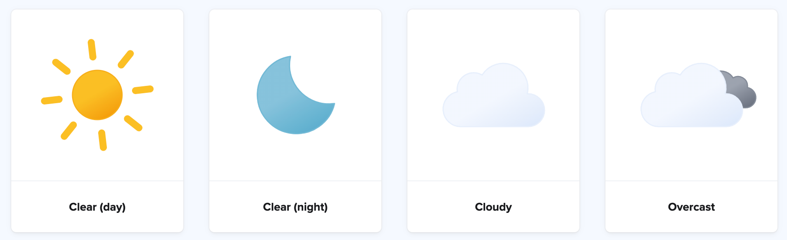

# GET data - deel 2

Je kunt de waarde van een GET-parameter ook gebruiken om bijvoorbeeld iets uit een array in je PHP-script te lezen.


### Opdracht 1 - Een GET-parameter gebruiken om iets uit een associatieve array te lezen 
{: .text-blue-100 .fs-6 }

- Maak een nieuw bestand `hetweer.php`
- Zet hier deze associatieve array in (tussen de PHP-tags!):

```php
// Associatieve array met weersvoorspelling per dag
$voorspelling = [
    "ma" => 20,
    "di" => 21,
    "wo" => 29,
    "do" => 19,
    "vr" => 24,
    "za" => 22,
    "zo" => 23
];
```

Lukt het je nu om de juiste temperatuur op het scherm te krijgen door deze URL op te vragen?
`hetweer.php?dag=ma` of `hetweer.php?dag=wo` enzovoorts.


---

### Bonus uitdaging
{: .text-green-100 .fs-6 }

- Maak een tweede associatieve array met dezelfde *keys* (ma, di, wo enzovoorts)
- Zet urls in naar weer-icoontjes die bij die dag horen - [hier vind je mooie icons die je kunt downloaden en gebruiken](https://bas.dev/projects/weather-icons).
- Lees de juiste afbeeldings-url voor de opgevraagde dag uit de tweede array 
- Gebruik een `` tag om het icoon er ook bij te zetten
- Maak er een mooie pagina van met behulp van je frontend skills
- Lukt het je om ook de temperatuur in fahrenheit uit te rekenen en die er bij te zetten?



---

Je hebt nu een aantal zaken gecombineerd uit de afgelopen lessen:

- Associatieve Arrays
- PHP en HTML combineren
- echo gebruiken 
- GET-parameters uitlezen via de speciale $_GET variabele
- Berekeningen uitvoeren
{: .text-blue-300 .fs-4 }

---

Lees nog een keer de theorie en opdrachten van [Les 3](../les-3) en [Les 4](../les-4) door en bekijk de lesslides. 
Veel zelf oefenen en herhalen zorgt er voor dat je het steeds beter gaat begrijpen en zelf oplossingen kunt gaan programmeren met variabelen, arrays en input uit requests.
{: .text-green-100 .fs-4 }

Browse ook eens door de [PHP-documentatie](https://www.php.net/manual/en/funcref.php) om een idee te krijgen welke functions er zijn en hoe je ze gebruikt. Probeer dingen uit.
{: .text-green-100 .fs-4 }
