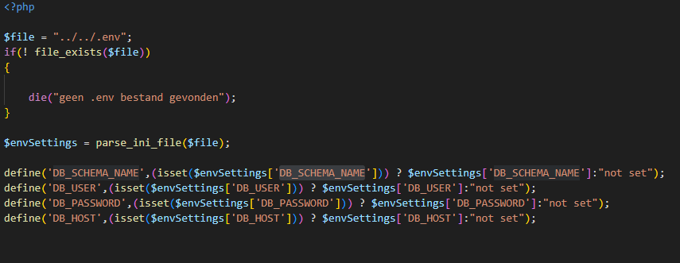
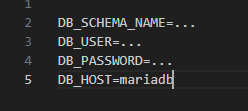
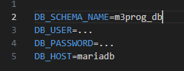
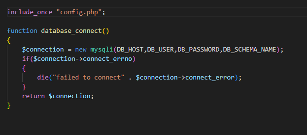

# Database verbinding maken

De volgende stap is om de gegevens uit de database te halen.

Dit doe je door in een PHP-script eerste verbinding te maken met de database server.
Als de verbinding werkt kun je met de SQL-opdrachten (die je in phpMyAdmin al zag) de gegevens uit de meterstanden table gaan halen.

- maak onder `source` twee bestanden:
    - `config.php`
    - `database.php`

## Config

- open `config.php` en zet daar de volgende code in:
    > 

- deze code leest de `.env` file uit
    > - die staat in je `m3prog_project` directory

## Config data in .env

- open `.env_example` en zet daar het volgende in:
    > 

- kopieer al die regels nu
    - zet die ook in `.env`

- open je `docker-compose.yml`
    - ga naar de `# MariaDB Service`
        - kopieer de waardes van:
            - `MYSQL_DATABASE` en:
                - vervang voor `DB_SCHEMA_NAME` de `...` achter `=` in je `.env` met de waarde van `MYSQL_DATABASE`
                > 
            - doe dat ook voor:
                - `DB_USER=...`
                - `DB_PASSWORD=...` (gebruik `NIET` het `root` wachtwoord)

## Database connectie

- open `database.php`
    - zet daar de volgende code in:
        > 

## Gebruiken

- maak een nieuwe file:
    - `connectiontest.php`
        - in de directory `public/06`
    - eerst `includen` we onze` databasep.php`:
        > 

- nu kunnen we een connection maken:
    > 
- als laatst testen we of we kunnen selecteren
    > 
    
> - `SELECT 1` werkt altijd tenzij:
>     - je geen connection 
>     - of rechten hebt           

## Testen

- open je `connectiontest.php` in je browser
    - test of je dit krijgt met je browser:
    > 
    

## klaar
- commit alles naar je github

