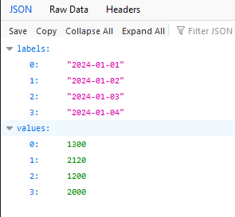
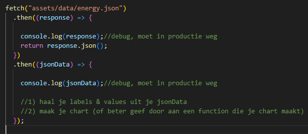
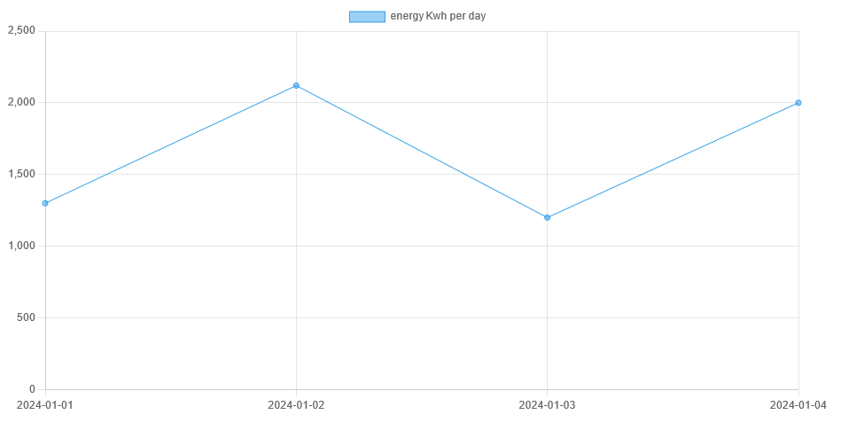

# Een test JSON file maken

Het is handig om eerst te oefenen met een bestand met de juiste JSON structuur.
Zo kun je eerst uitproberen of je deze JSON met Javascript om kan zetten in een Object voordat je meteen gegevens uit de database gaat gebruiken

Wij gaan straks een json file maken met deze structuur:

> 

### Json File

- maak een nieuwe file:
    - `assets/data/energy.json`

- zet daar het volgende in:
> 

### Json ophalen

> nu staat `energy.json` in `assets/data/energy.json`
> deze is nu beschikbaar om via de browser op te halen

- open je browser en probeer de file te tonen:
    > 

- open `meterstandApp.js`
    - kijk even goed waar je de data in de chart stop
        > daar gaan we code veranderen door de `json` op te halen met `fetch` 
        - gebruik hiervoor de code hieronder als je niet weet hoe fetch werkt:
            > 
            > LET OP je kan je chart pas maken `nadat` je de json ontvangen hebt

### testen

- test nu door `meterstanden.html` te openen:
    >

 - maak een screenshot van het resultaat:
    - `jsonchart.png`
    - zet deze in je `screenshots` directory

> zie je hoe de jsonfile nu bepaald wat je op het scherm krijgt?

### data aanpassen

- pas nu je json file aan zorg dat er 10 waarden in komen te staan

- toon dat in je browser

 - maak een screenshot van je `het resultaat`:
    - `10waarden.png`
    - zet deze in je `screenshots` directory

## klaar
- commit alles naar je github

### Meer info over fetch en JSON

- [Korte JSON tutorial](https://www.youtube.com/watch?v=iiADhChRriM&ab_channel=WebDevSimplified) (Youtube)
- [JSON gegevens controleren](https://jsonlint.com/) - Hiermee kun je zien of je JSON klopt

- [JSON](https://developer.mozilla.org/en-US/docs/Learn/JavaScript/Objects/JSON)
- [JavaScript Fetch API](https://www.javascripttutorial.net/javascript-fetch-api/)

