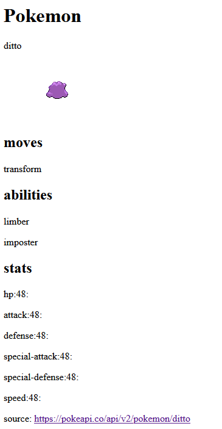

# opstarten

- maak een php file aan:
    - `apitest.php`
    > hier werk je in voor deze opgave

### Opdracht

- werk in:
    - `apitest.php`

- Maak een test request (de url opvragen in je browser) naar de API van jouw keuze
- laat nu data zijn door dynamische html te maken met php
    - Met HTML en CSS zodat het er mooi uitziet.
        > voorbeeld:  
        > 
    
## screenshot
- maak een screenshot van je resultaten:
    - `uitdeapi.png`
    - zet deze in je `screenshots` directory

## klaar
- commit alles naar je github